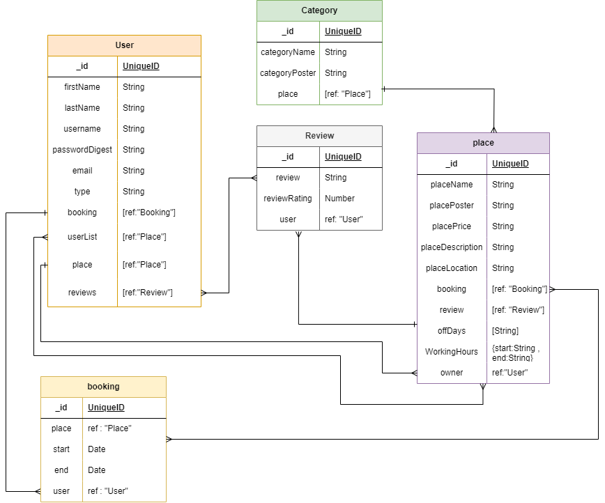

# Entertainment Guid

## Date: 10/6/2024

### By: Jasim Salman | Mohammed Saeed | Zainab Al-Talaq

#### [GitHub](https://github.com/jasimSalman) | [LinkedIn](https://www.linkedin.com/in/jasimsalman1/)

#### [GitHub](https://github.com/m00hammed) | [LinkedIn](https://www.linkedin.com/in/<username>/)

#### [GitHub](https://github.com/zainabaltalaq) | [LinkedIn](https://www.linkedin.com/in/<username>/)

---

### **_Description_**

#### "Entertainment Guide" is your ultimate resource for discovering entertainment venues in Bahrain. Our website offers a wide range of categories, from swimming pools to parks and beyond, allowing users to easily explore various options. Each listing includes detailed information about the venue, and for those venues that offer reservations, users can conveniently book their visit directly through our platform.

---

### **_Technologies Used_**

- React JS
- Express JS
- Mongo DB
- Node JS

---

### **_Getting Started_**

##### Sign up and sign in as a new user and then begin viewing the different sections of the website.

##### A Trello board was used to keep track of development progress and can be viewed [here](https://trello.com/b/cavvFYqQ/project-3).

##### The project was deployed and can be viewed [here](URL).

---

### **_Screenshots_**

##### Wireframe

##### ERD Diagram

##### Component Hierarchy Diagrams

---

### **_Future Updates_**

- [ ] Add more categories and features.
- [ ] Add payment methods
- [ ] Add Hotel reservations
- [ ] Add Taxi reservations
- [ ] Add More information about the tourist places

---

### **_Credits_**

##### github: [github](https://github.com/SEI-09-Bahrain/class_wiki?tab=readme-ov-file)

##### w3school: [w3school](https://www.w3schools.com/)

---
